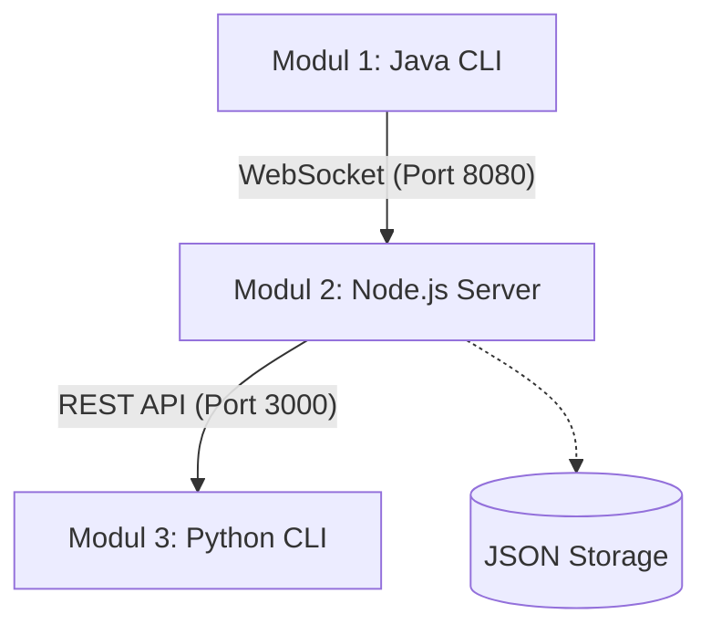
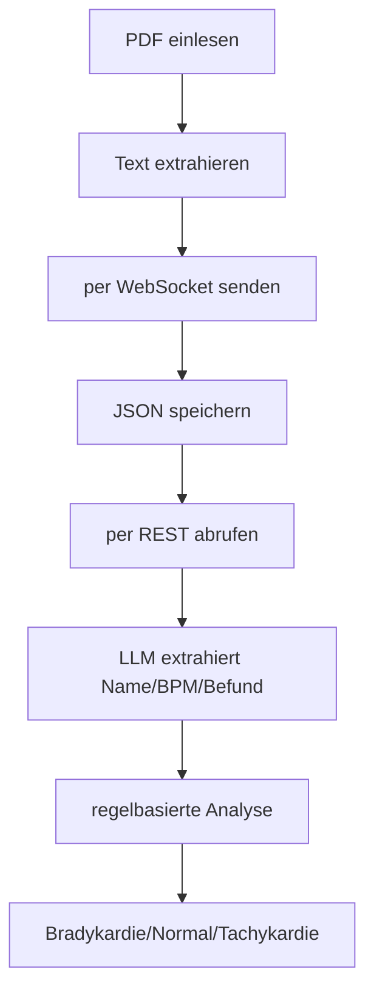

```mermaid
graph TD
    M1[Modul 1: Java CLI] -- "WebSocket (Port 8080)" --> M2[Modul 2: Node.js Server]
    M2 -- "REST API (Port 3000)" --> M3[Modul 3: Python CLI]
    M2 -.-> JSON[(JSON Storage)]
```

```mermaid
flowchart TD
    A[PDF einlesen] --> B[Text extrahieren]
    B --> C[per WebSocket senden]
    C --> D[JSON speichern]
    D --> E[per REST abrufen]
    E --> F[LLM extrahiert Name/BPM/Befund]
    F --> G[regelbasierte Analyse]
    G --> H[Bradykardie/Normal/Tachykardie]
```
